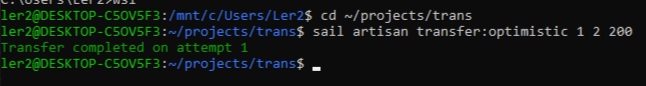
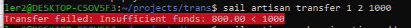

# Transaction Demo — изучение транзакций в Laravel

Проект для демонстрации работы с транзакциями, пессимистичными и оптимистичными блокировками в Laravel.

Изучение и демонстрация атомарных операций в БД на Laravel. Реализованы переводы между счетами с пессимистичными (`lockForUpdate`) и оптимистичными (версионирование) блокировками, вложенные транзакции с резервированием. Использованы Laravel Sail (Docker), Artisan commands, миграции, сиды. Покрыта обработка исключений и повторные попытки при конфликтах.

## Технологии
- Laravel 12
- MySQL (через Laravel Sail / Docker)
- PHP 8.2+

## Функциональность
- Перевод средств между счетами с **пессимистичной блокировкой** (`lockForUpdate`)
- Перевод с **вложенными транзакциями** (резервирование)
- Перевод с **оптимистичной блокировкой** (через поле `version` с автоматическими повторами)

## Запуск
```bash
git clone ...
cd trans
composer install
sail up -d
sail artisan migrate --seed
```

## Примеры команд
```bash
sail artisan transfer 1 2 200
sail artisan transfer:reserve 1 2 200
sail artisan transfer:optimistic 1 2 200
```

## Базы данных

По умолчанию проект настроен на **MySQL** (через Laravel Sail).

<!--### PostgreSQL 
(coming soon in feature/postgres branch)

Поддержка PostgreSQL будет реализована в ветке [`feature/postgres`](ссылка).  

Для переключения:
```bash
git checkout feature/postgres
cp .env.example .env
# настройте DB_CONNECTION=pgsql и параметры подключения
./vendor/bin/sail up -d
./vendor/bin/sail artisan migrate --seed
```
-->
### Структура БД

- `accounts` (id, name, balance, reserved, version)  
  *Поля `reserved` и `version` используются соответственно во вложенных транзакциях (`transfer:reserve`) и оптимистичной блокировке (`transfer:optimistic`).*
- `transactions` (id, from_account_id, to_account_id, amount, status)


## Что показывает проект
- Атомарность операций (commit/rollback)
- Как избежать гонок с lockForUpdate
- Как работает savepoint (вложенные транзакции)
- Оптимистичная блокировка без блокировок строк


## Скриншоты работы 

Скриншоты терминала с успешным переводом и ошибкой при недостатке средств:




## Лицензия - MIT
См. файл [LICENSE](LICENSE.md) для получения дополнительной информации.


